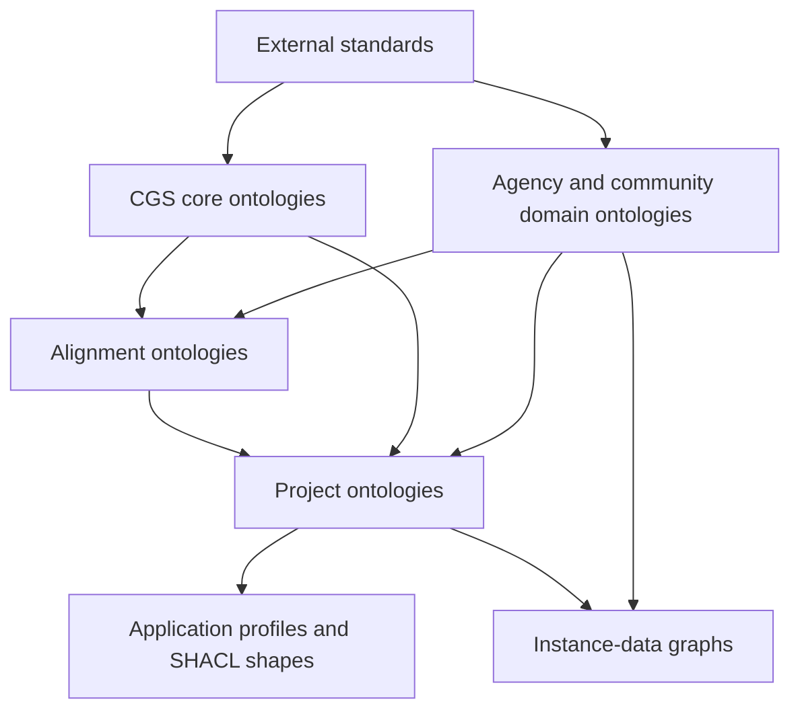

# CGS Knowledge Graph Guidelines

This repository defines the architecture, namespace policy, governance practices, and publication requirements for ontologies and knowledge graphs developed or integrated by CGS.

